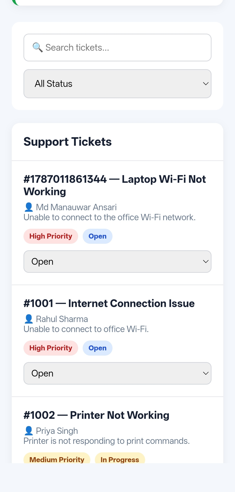
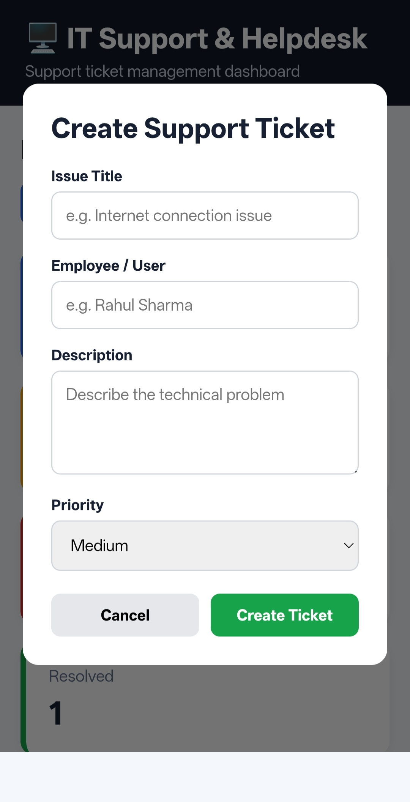
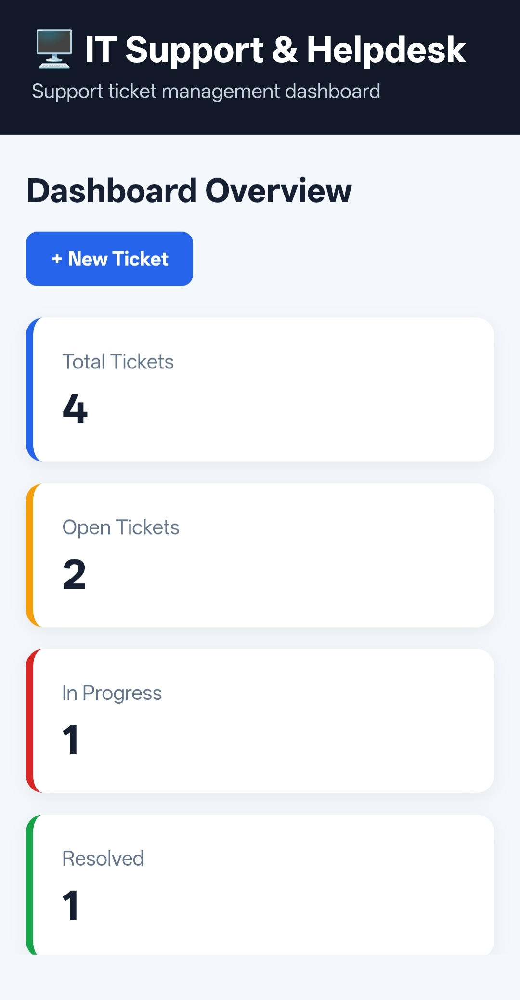
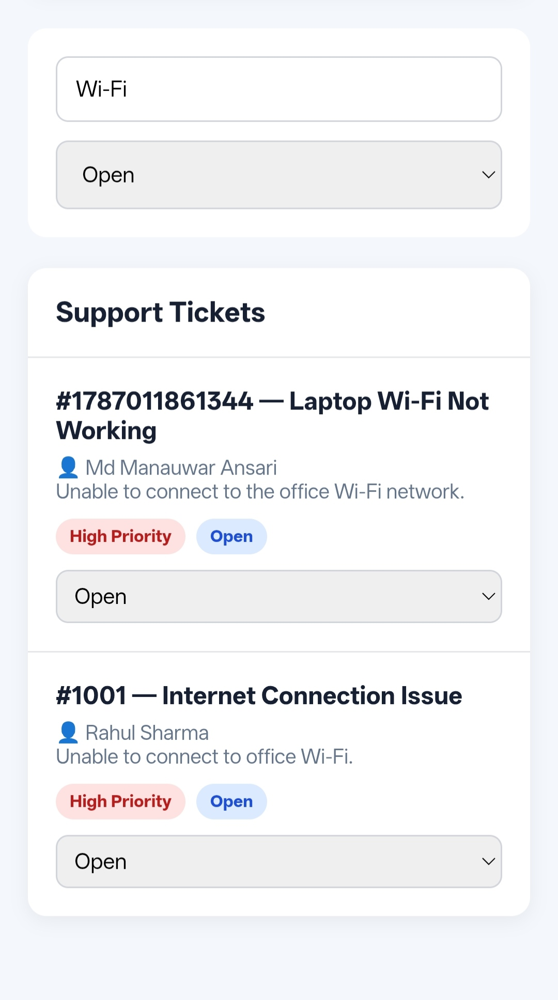

# 💻 IT Support & Helpdesk Dashboard

A responsive web-based IT Support & Helpdesk Dashboard designed to manage support tickets, priorities, and issue status efficiently.

🔗 **Live Demo:**  
https://manauwar001.github.io/IT-Support-Helpdesk-Dashboard/

---

## 🚀 Features

- 🎫 Create new support tickets
- 📊 Dashboard with ticket statistics
- 🔎 Search support tickets
- 🏷️ Filter tickets by status
- 🔴 High / Medium / Low priority management
- 🔄 Update ticket status
- 📱 Responsive design for mobile and desktop
- 💾 Dynamic ticket management using JavaScript

---

## 🛠️ Technologies Used

- HTML5
- CSS3
- JavaScript
- Git & GitHub
- GitHub Pages

---

## 📸 Project Screenshots

### Dashboard Overview

### Create Support Ticket

### Support Tickets

### Ticket Search & Filter

---

## 🎯 Project Purpose

This project demonstrates a practical IT Support / Helpdesk workflow where users can create, search, filter, and manage technical support tickets based on priority and status.

---

## 👨‍💻 Developer

**Md Manauwar Ansari**

BCA Graduate | IT Support | Networking | App Development | Data Analysis

🔗 GitHub: https://github.com/manauwar001

---

⭐ If you find this project useful, feel free to star the repository.
